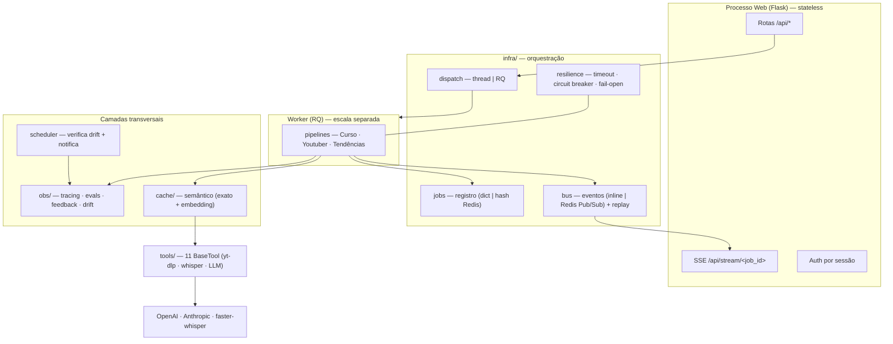
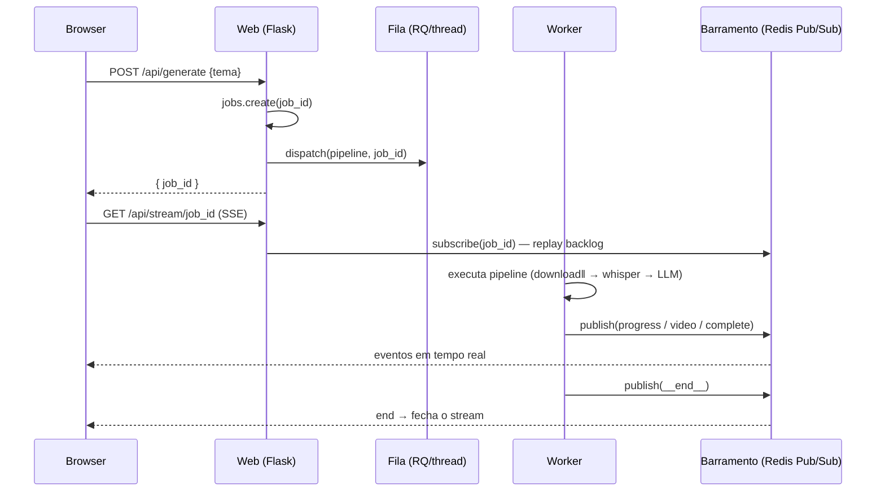
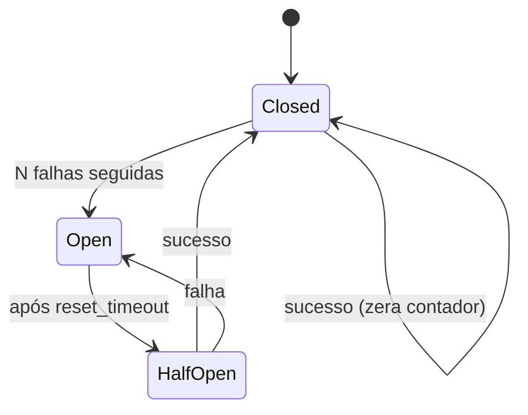
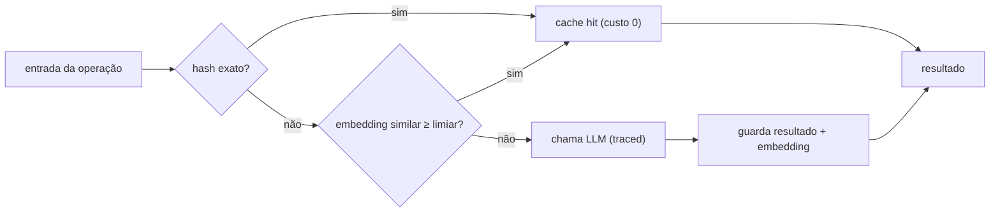
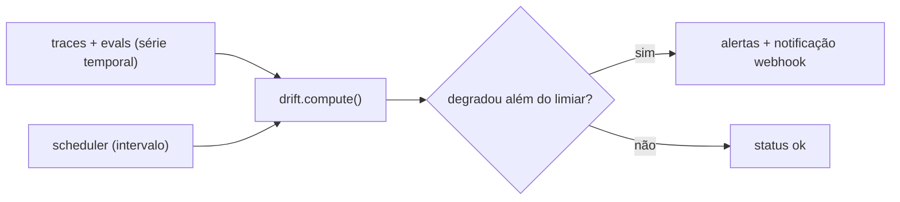

# 01 · BACKEND

> Núcleo de execução do StudyFlow: API fina, fila externa, workers, e as
> camadas transversais de resiliência, observabilidade e cache. Documenta o que
> **existe e está testado** hoje; o que é alvo aparece marcado.

---

## 1. Princípio do backend

O processo web é **fino e stateless**: recebe a requisição, valida, **enfileira**
o trabalho e devolve um `job_id`. Nenhum pipeline roda dentro do request. O
estado vive fora do processo (fila, registro de jobs e barramento de eventos),
o que permite escalar web e workers de forma independente.

Um único código atende dois modos, escolhidos por `RUN_MODE`:

| | `inline` (dev) | `redis` (prod) |
|---|---|---|
| Execução do job | thread no processo web | RQ + worker separado |
| Progresso (SSE) | barramento em memória | Redis Pub/Sub + replay |
| Registro de jobs | dict em memória | hash Redis (TTL) |
| Escala | 1 processo | web e workers escalam separados |

---

## 2. Componentes do backend



| Módulo | Arquivo | Responsabilidade |
|---|---|---|
| Rotas/API | `app.py` | endpoints REST, SSE, auth, health |
| Dispatch | `infra/dispatch.py` | thread (inline) ou enfileira no RQ (redis) |
| Barramento | `infra/bus.py` | eventos do SSE; replay para assinante atrasado |
| Registro | `infra/jobs.py` | metadados + resultado do job |
| Resiliência | `infra/resilience.py` | timeout, circuit breaker, fail-open |
| Pipelines | `pipelines.py` | os 3 fluxos de ponta a ponta |
| Worker | `worker.py` | consumidor RQ (modo redis) |
| Cache | `cache/*` | cache semântico de chamadas de LLM |
| Observabilidade | `obs/*` | tracing, custo, evals, feedback, drift |
| Agendador | `scheduler.py` | verifica drift periodicamente e notifica |

---

## 3. Ciclo de vida de um job



O **replay** resolve dois problemas do desenho original: assinante que conecta
depois não perde eventos, e mais de um assinante pode ouvir o mesmo job (antes,
o consumidor único drenava a fila).

---

## 4. Modelo de resiliência

Toda chamada de LLM passa por `guard(provider, fn, timeout, fallback)`:



- **timeout**: chamada pendurada não trava o pipeline.
- **circuit breaker por provider**: se a OpenAI cair, não derruba o que usa Claude.
- **fail-open**: onde a degradação é aceitável (ex.: síntese de tendências),
  retorna um fallback e segue, em vez de abortar o job inteiro.

Etapas críticas (quiz, roteiro) propagam o erro; etapas auxiliares degradam.

---

## 5. Cache semântico



Cada acerto vira um trace `cache_hit` de custo zero — a economia aparece em
dólar no `/obs`. Camada exata sempre; semântica opcional (embedding).

---

## 6. Observabilidade e drift

`traced_llm` é o funil único: aplica resiliência **e** grava um trace
(operação, modelo, latência, status, tokens, custo) por `trace_id` (= `job_id`).
Sobre essa série temporal:

- **LLM-as-Judge** avalia a qualidade do quiz (groundedness, relevância,
  coerência, alucinação).
- **Feedback 👍/👎** humano via `POST /api/feedback`.
- **Drift** compara janela recente vs. baseline e dispara alertas; o
  `scheduler.py` roda isso periodicamente e notifica por webhook.



---

## 7. Superfície de API

| Rota | Método | O quê |
|---|---|---|
| `/login` `/logout` | GET/POST | autenticação por sessão |
| `/curso` `/youtuber` `/trends` `/obs` | GET | páginas dos módulos + dashboard |
| `/api/generate` | POST | inicia pipeline do Curso |
| `/api/youtuber/trends` | POST | tendências do nicho (síncrono) |
| `/api/youtuber/generate` | POST | inicia pipeline de Highlights |
| `/api/trends/analyze` | POST | inicia pipeline de Tendências (3 chains) |
| `/api/stream/<job_id>` | GET | SSE de progresso |
| `/api/quiz/<job_id>` | GET | resultado do quiz |
| `/api/feedback` | POST | registra 👍/👎 |
| `/api/observability/summary` | GET | métricas agregadas |
| `/api/observability/drift` | GET | verificação de drift (ao vivo) |
| `/api/observability/drift/check` | POST | verificação + persistência |
| `/api/observability/drift/history` | GET | histórico de verificações |
| `/healthz` | GET | health check (LB/K8s) |

Contrato de erro consistente: `{ "error": "..." }` com status HTTP adequado.

---

## 8. Execução

```bash
# Dev (inline, sem Redis)
python app.py

# Prod (redis): web + worker + scheduler
gunicorn --worker-class gthread --workers 2 --threads 8 --timeout 0 app:app
python worker.py
python scheduler.py

# Tudo via Docker Compose
docker compose up --build --scale worker=3
```

---

## 9. Definição de Pronto (atual)

- App sobe em `inline` (sem dependências) e em `redis` (workers separados).
- Web stateless: jobs enfileirados, nunca executados no request.
- SSE funciona com replay e múltiplos assinantes.
- Toda chamada de LLM tem timeout + circuit breaker; degradações são fail-open.
- Cada chamada de LLM é rastreada (custo/latência) por `trace_id`.
- Cache reduz chamadas repetidas; economia visível no `/obs`.
- Drift compara janelas e alerta; scheduler roda e notifica.
- 6 suítes de teste cobrem infra, obs, evals, cache, drift e scheduler.

**Alvo (próximos passos):** storage em object storage (S3/MinIO), store de obs/
cache em Postgres/pgvector, idempotência nos endpoints de escrita, HPA no K8s.
