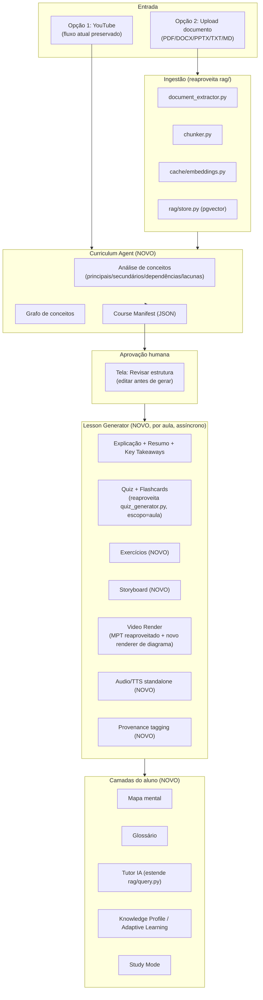

# AI Course Generation Engine — Diagnóstico e Arquitetura Proposta

> Documento de diagnóstico antes de qualquer alteração de código, conforme pedido.
> Todas as referências de arquivo abaixo são do repositório real (`youtube-study-agent`), não hipotéticas.

---

## 1. Arquitetura atual identificada

### 1.1 Como o Curso funciona hoje

`pipelines.run_curso_pipeline()` é **um job monolítico único**, disparado por `POST /api/generate`, executado inteiro no worker (RQ em produção, thread em dev — `infra/dispatch.py`), com progresso via SSE (`infra/bus.py`). Passo a passo real:

```
YouTubeSearchTool (busca 3 vídeos, escolhe 1 com 3–25min)
  → VideoDownloaderTool + AudioExtractorTool (baixa vídeo, extrai áudio)
  → TranscriberTool (faster-whisper)
  → QuizGeneratorTool (LLM → quiz + flashcards, um único schema Pydantic)
  → RoadmapGeneratorTool (LLM → módulos/tópicos, a partir da MESMA transcrição)
  → LessonSegmenterTool (LLM → pontos de corte "aulas" no vídeo, por timestamp)
  → VideoSplitterTool (ffmpeg corta o vídeo local nos timestamps)
  → _maybe_index_rag() (indexa a transcrição inteira no pgvector, se RAG_ENABLED=1)
```

Tudo roda **dentro de um único job_id**, sem checkpoint intermediário: se qualquer etapa falhar, o job inteiro precisa ser refeito do zero (viola o requisito 13 do pedido — "operações caras devem poder ser retomadas sem reiniciar o curso inteiro").

### 1.2 Onde o curso "vive" depois de gerado

Isto é o gap mais importante: **não existe uma tabela `courses`/`lessons` persistente**. O que existe:

- O resultado do pipeline (quiz, roadmap, clips) vive só em `infra/jobs` (dict em memória ou hash Redis com TTL) — **efêmero**, some quando o job expira.
- `auth/prefs.py` (SQLite `output/users.db`) guarda um registro **achatado e único** por usuário em `curso_atual`: `{titulo, subtitulo, progresso, aula_atual}` — não é uma estrutura de módulos/aulas, é um resumo de "onde você parou".
- `catalog.py` é uma lista Python **estática, hardcoded** (10 cursos de exemplo) — não tem relação com o que a IA gera; alimenta só a tela Catálogo/Trilhas.
- `analytics/store.py` (Postgres) tem uma tabela `publicacoes`, mas é para métrica de posts do YouTube/Instagram publicados (Growth), **não é sobre cursos**.

Ou seja: hoje um curso gerado não é uma entidade que sobrevive, é editável ou consultável depois — é um evento de job que produz artefatos soltos.

### 1.3 RAG — já existe infraestrutura sólida (ponto positivo grande)

`rag/` já tem praticamente toda a base necessária pro Modo Criativo:

| Arquivo | O que já faz |
|---|---|
| `rag/document_extractor.py` | Extrai texto em Markdown de PDF/PPTX/DOCX/XLSX/CSV/HTML/EPUB/ZIP via MarkItDown (com fallback pypdf/python-docx/python-pptx se markitdown faltar) |
| `rag/chunker.py` | `chunk_segments()` (por transcrição, com timestamp) e `chunk_text()` (por documento) |
| `rag/index.py` | `index_document()` / `index_transcript()` — gera embedding e grava na store |
| `rag/store.py` | `PgVectorStore` (Postgres+pgvector, produção) e `InMemoryStore` (fallback/testes) |
| `rag/query.py` | `search()` + `answer()` — resposta ancorada no contexto, **já cita a fonte** (timestamp pro vídeo) |

Isso já está **conectado** em `app.py`:
- `POST /api/curso/material` — upload de PDF/PPTX/DOCX/etc, indexa como material de apoio
- `POST /api/curso/material_url` — indexa uma URL via `tools/crawler_client.py` (crawl4ai)
- `GET/POST /rag` — tela de "Pergunte ao vídeo" já existe, genérica

**O gap não é a infraestrutura de RAG — é o USO dela.** Hoje o documento entra como material *complementar* a um curso baseado em vídeo do YouTube. O pedido da Opção 2 é inverter isso: o documento vira a **fonte primária**, e todo o curso (currículo, aulas, quiz) é gerado a partir dele, não só consultável via Q&A.

### 1.4 Quiz e Flashcards

`tools/quiz_generator.py` já gera os dois juntos, com schema Pydantic (`Flashcard`, `AlternativaQuestao`, `QuizOutput`) — mas está acoplado a **uma transcrição inteira de vídeo**, não a uma aula individual. Pra virar "quiz por aula" (pedido item 5), precisa ser invocado por aula, não uma vez por curso.

### 1.5 Geração de vídeo/áudio — existe, mas não é o tipo certo

`tools/mpt_client.py` fala com o MoneyPrinterTurbo (serviço FastAPI separado, `docker-compose.full.yml`/`mpt-api`) — usado hoje pelo módulo **Criador/Estúdio** (`run_estudio_pipeline`). Ele gera vídeo curto com **footage de banco de imagens + narração TTS (Edge TTS)** — bom pra conteúdo de redes sociais, mas é o oposto do que o pedido item 6 quer: vídeo explicativo com **storyboard, diagramas, fluxogramas, comparações, conceitos destacados**. MPT não faz isso — ele não tem noção de "cena com diagrama".

Não existe nenhum módulo de TTS *standalone* (áudio sem vídeo) — TTS só existe embutido dentro do MPT.

`tools/openai_image_client.py` (gpt-image-1-mini) e `tools/fooocus_client.py` já geram imagem a partir de prompt — são a peça mais próxima de "gerar um diagrama" hoje, mas nunca foram usados para isso (usados pra thumbnail/carrossel do Instagram).

### 1.6 Infra transversal (excelente, super reaproveitável)

- `infra/dispatch.py` + `infra/bus.py` + `infra/jobs.py`: fila+SSE+registro de job, já abstrai `inline` (dev) vs `redis` (prod) — é exatamente o padrão que os novos agentes assíncronos (vídeo, áudio) devem seguir.
- `infra/resilience.py`: `guard()` com circuit breaker/timeout/fail-open por provider — todo novo agente de LLM deve passar por aqui.
- `cache/llm_cache.py`: `smart_call()` com cache semântico (hash exato + embedding) — evita gastar token gerando a mesma coisa duas vezes; crítico pro Curriculum Agent, que pode ser chamado de novo se o usuário editar o manifest.
- `obs/tracing.py` (`traced_llm`): toda chamada de LLM já fica registrada em custo/latência (isso é o que a tela `/obs` mostra, que acabamos de corrigir). Todo agente novo PRECISA passar por aqui — senão o custo do Course Engine fica invisível de novo.

---

## 2. Componentes reutilizáveis (resumo)

| Componente | Reuso |
|---|---|
| `rag/document_extractor.py`, `chunker.py`, `index.py`, `store.py`, `query.py` | Motor de ingestão de documento inteiro — só muda quem chama e pra quê |
| `tools/quiz_generator.py` | Reaproveita o schema Pydantic; muda o escopo de "vídeo inteiro" pra "aula" |
| `tools/roadmap_generator.py` | Vira ponto de partida do Curriculum Agent (Opção 1); Opção 2 precisa de uma versão mais rica (grafo de dependência, não só lista de módulos) |
| `tools/lesson_segmenter.py` | Mesma ideia, mas pra segmentar TEXTO por conceito em vez de vídeo por timestamp |
| `infra/dispatch.py`, `bus.py`, `jobs.py` | Base de todo pipeline assíncrono novo — sem reinventar fila/SSE |
| `cache/llm_cache.py` | Cache semântico pra todo agente novo baseado em LLM |
| `obs/tracing.py`, `obs/judge.py` | Observabilidade e eval automáticos, "de graça", se os agentes novos seguirem o padrão `traced_llm` |
| `tools/mpt_client.py` | Reaproveitável como um dos possíveis "renderers" de vídeo (não o único) |
| `tools/openai_image_client.py` | Base pra gerar imagem de diagrama/visual de cena |
| `auth/prefs.py` | Padrão de storage simples (SQLite key-value) — mantém pra preferência, mas NÃO serve pra Course Manifest (precisa de tabela relacional de verdade) |

---

## 3. Gaps (o que falta de verdade)

1. **Sem modelo de dados persistente de curso.** Maior gap estrutural — sem isso, nada do resto (manifest editável, provenance, adaptive learning, resumo de progresso por aula) tem onde morar.
2. **Sem Curriculum Agent de verdade.** `roadmap_generator.py` faz 1 chamada de LLM → lista de módulos. Não identifica pré-requisito, dependência entre conceitos, lacuna, duplicidade — é geração, não currículo.
3. **Sem Course Manifest revisável.** O pipeline roda cego, ponta a ponta, sem checkpoint de aprovação do usuário antes da parte cara (vídeo).
4. **Sem storyboard/cena para vídeo.** MPT não serve pro tipo de vídeo pedido (educacional, com diagrama).
5. **Sem TTS standalone / Podcast Mode.**
6. **Sem mapa mental de curso, glossário, checkpoints inline, exercício aberto avaliado por IA, tutor com contexto de aula+histórico, Knowledge Profile, Study Mode.** Nenhum desses existe hoje em nenhuma forma.
7. **Sem provenance por afirmação.** O RAG cita fonte na resposta de Q&A (`/rag`), mas nada disso é gravado como metadado permanente de "esta aula veio deste trecho".
8. **Pipeline monolítico, não retomável.** Viola diretamente o requisito 13 do pedido.

---

## 4. Nova arquitetura proposta (visão geral)



Princípio-chave: **Opção 1 (YouTube) não muda de motor** — continua usando `roadmap_generator`+`quiz_generator`+`lesson_segmenter` como hoje. O Curriculum Agent novo e o Course Manifest são a camada que passa a **envolver os dois fluxos**, não substituir o que já funciona. Isso satisfaz diretamente "não quero remover nem quebrar nenhuma funcionalidade existente".

---

## 5. Modelo de dados

### 5.1 Course Manifest (JSON — fonte de verdade entre agentes)

Praticamente o schema que você descreveu no pedido, com os campos que o código real vai precisar amarrar (ids, status, referência de fonte):

```json
{
  "course_id": "uuid",
  "origem": "youtube | documento",
  "title": "string",
  "description": "string",
  "audience": "iniciante | estudante | desenvolvedor | arquiteto | executivo | especialista",
  "difficulty": "introducao | fundamentos | intermediario | avancado | deep_dive",
  "estimated_duration_min": 120,
  "style": "academico | executivo | professor | tecnico | pratico | storytelling",
  "learning_objectives": ["string"],
  "prerequisites": ["string"],
  "status": "rascunho | aguardando_aprovacao | aprovado | gerando | concluido | erro",
  "modules": [
    {
      "module_id": "uuid",
      "title": "string",
      "objective": "string",
      "order": 1,
      "lessons": [
        {
          "lesson_id": "uuid",
          "title": "string",
          "objective": "string",
          "duration_min": 15,
          "concepts": ["conceito_id", "..."],
          "source_references": [
            {"doc_id": "material:abc123_arq.pdf", "chunk_ids": ["c1","c2"], "page": 12}
          ],
          "video_required": true,
          "audio_required": true,
          "quiz_required": true,
          "exercise_required": true,
          "status": "pendente | gerando | concluido | erro"
        }
      ]
    }
  ]
}
```

### 5.2 Tabelas Postgres (novo módulo `curso/store.py`, mesmo padrão de `analytics/store.py` e `rag/store.py` — schema idempotente, `CREATE TABLE IF NOT EXISTS`)

```
courses            (id, manifest_json, origem, status, user_key, criado_em, atualizado_em)
modules            (id, course_id FK, titulo, objetivo, ordem)
lessons            (id, module_id FK, titulo, objetivo, duracao_min,
                     video_required, audio_required, quiz_required, exercise_required,
                     status, video_url, audio_url)
concepts           (id, course_id FK, nome, nivel_dificuldade, eh_pre_requisito_de [self-FK])
lesson_concepts    (lesson_id FK, concept_id FK)   -- N:N
lesson_content     (lesson_id FK, explicacao, resumo, key_takeaways_json, transcricao)
exercises          (id, lesson_id FK, tipo, enunciado, resposta_esperada, avaliacao_criteria)
provenance_claims  (id, lesson_id FK, claim_text, doc_id, chunk_id, page, section)
knowledge_profile  (user_key, concept_id FK, score_pct, atualizado_em)
```

Isso é aditivo — não toca em `publicacoes` (Growth), `user_prefs` (preferências), nem nas tabelas do RAG. `curso_atual` em `auth/prefs.py` pode passar a guardar só `{course_id, lesson_id}` (ponteiro pro progresso), em vez do resumo achatado de hoje.

---

## 6. Novos agentes necessários

| Agente | Entrada | Saída | Reaproveita |
|---|---|---|---|
| **CurriculumAgent** | transcrição (Opção 1) ou chunks RAG (Opção 2) + config (público/nível/duração/estilo) | Course Manifest (JSON) | `roadmap_generator.py` como base de prompt; grafo de dependência é novo |
| **LessonContentAgent** | 1 lesson do manifest + chunks relevantes | explicação, resumo, key takeaways | Padrão LangChain+Pydantic de `quiz_generator.py`/`roadmap_generator.py` |
| **QuizFlashcardAgent** | 1 lesson | quiz + flashcards daquela aula | `quiz_generator.py` direto, só troca o escopo de input |
| **ExerciseAgent** | 1 lesson + objetivo | exercícios abertos/estudo de caso + critério de avaliação | Novo, mesmo padrão Pydantic |
| **StoryboardAgent** | 1 lesson | JSON de cenas (narration/visual_description/duration/source_reference) | Novo |
| **VideoRenderAgent** | storyboard | vídeo final | `mpt_client.py` para cenas "narração+footage"; novo renderer (Pillow/matplotlib/mermaid→imagem) para cenas de diagrama, unidas com `tools/video_concat.py` (já existe, já usado nos Shorts) |
| **AudioAgent** | texto da aula | áudio (mp3) | Novo — TTS standalone (Edge TTS direto, sem passar pelo MPT) |
| **ProvenanceAgent** | claim gerado + chunks usados no prompt | registro em `provenance_claims` | Os chunk_ids já vêm de `rag/query.search()` — é só persistir em vez de só responder |
| **GlossaryAgent** | conceitos do manifest | termo + definição + lessons onde aparece | Novo, reaproveita `concepts`/`lesson_concepts` |
| **TutorAgent** | pergunta do aluno + lesson atual + histórico | resposta ancorada | Extensão de `rag/query.answer()` — soma contexto de lesson+knowledge_profile |
| **AdaptiveLearningAgent** | eventos (quiz, exercício, checkpoint) | atualização de `knowledge_profile` | Novo, sem LLM (é cálculo/agregação) |

---

## 7. Fluxo de telas

```
/curso (existente)
  └─ botão "Criar Curso" → modal/tela de escolha
        ├─ Opção 1: YouTube → MANTÉM fluxo atual (mesma tela/JS de hoje)
        └─ Opção 2: Modo Criativo (NOVA tela)
              ├─ upload de documento (obrigatório) — reaproveita UI de /api/curso/material
              ├─ formulário de config (nome sugerido pela IA, objetivo, público, nível,
              │   duração, estilo)
              └─ POST → dispara CurriculumAgent (job assíncrono, SSE de progresso)

/curso/<course_id>/revisar (NOVA tela)
  └─ mostra o Course Manifest (módulos/aulas/objetivos) — editável
  └─ botão "Aprovar e gerar" → só AQUI dispara a geração pesada (vídeo/áudio/exercícios)

/curso/<course_id>/aula/<lesson_id> (evolui a tela de aula existente)
  └─ abas: Assistir | Ouvir | Ler | Praticar | Perguntar
  └─ botão "Não entendi" (dropdown: mais simples / outro exemplo / analogia / visual / mais técnico)
  └─ checkpoints inline ("antes de continuar…")

/curso/<course_id>/mapa-mental (NOVA tela)
/curso/<course_id>/glossario (NOVA tela)
/curso/revisar-tudo (NOVA tela — Study Mode: flashcards pendentes, conceitos fracos, quizzes errados)
```

---

## 8. Estratégia de geração de vídeo

Vídeo **por aula**, não por curso inteiro (permite retomar aula a aula). Duas trilhas de cena, decididas pelo `StoryboardAgent` por cena, não por aula inteira:

- **Cena "narração + visual estático/diagrama"**: gera a imagem do diagrama (matplotlib/Pillow determinístico para fluxograma/comparação/timeline — mais barato e mais confiável que pedir "desenhe um diagrama" pra um gerador de imagem genérico) + narra por cima com TTS. Isso cobre a maioria dos pedidos do item 6 (diagramas, fluxogramas, timelines, comparações, listas, conceitos destacados).
- **Cena "footage + narração"**: reaproveita `mpt_client.py` como está, pros trechos que fazem mais sentido como vídeo "de verdade" (exemplo real, storytelling).

`tools/video_concat.py` (já usado nos Shorts do Youtuber) une as cenas renderizadas em um único MP4 por aula. Assíncrono, um job por aula (não por curso), com status em `lessons.status`.

## 9. Estratégia de geração de áudio

TTS standalone, desacoplado do MPT (hoje só existe embutido lá dentro). Cada aula gera um áudio "Ouvir aula" a partir do texto da explicação — mesmo motor (Edge TTS, sem custo de API) que o MPT já usa, só que chamado direto. Podcast Mode (2 vozes em conversa) fica pra fase posterior — a arquitetura (um `AudioAgent` que recebe texto e devolve mp3) já comporta trocar "narração única" por "diálogo roteirizado" sem mudar o resto do pipeline.

## 10. Impacto no RAG

Nenhuma mudança estrutural — `rag/` vira o motor primário da Opção 2 em vez de complemento da Opção 1:

- `document_extractor.py` + `chunker.py` + `index.py`: usados exatamente como já são, só que o resultado alimenta o `CurriculumAgent` (não só o `/rag` de Q&A).
- `rag/query.search()`: usado pelo `LessonContentAgent`/`TutorAgent` pra buscar os chunks relevantes por conceito/pergunta — já devolve `chunk_id`+score, é a base do provenance.
- Adição pequena e não-disruptiva: os `doc_id`/`chunk_id` retornados precisam ser persistidos em `provenance_claims`, não só usados e descartados como hoje no `/rag`.

## 11. Estratégia de provenance

```
lesson → claims (afirmações geradas) → chunk_id → doc_id → documento original → página/seção
```

Como `rag/query.search()` já devolve os chunks usados para montar cada resposta, o `ProvenanceAgent` só precisa gravar essa associação no momento da geração (não é uma feature nova de busca, é persistência do que já se sabe). UI: botão "Ver fonte" na aula, abrindo o trecho + página do documento original — dado que já existe em `chunk`, só falta expor.

Regra do pedido (nunca misturar SOURCE MATERIAL com AI COMPLEMENTARY CONTENT silenciosamente): cada `claim` grava um campo `tipo: fonte | complementar` — se o `CurriculumAgent` detectar lacuna (ex: doc explica RAG mas não embeddings) e decidir complementar, marca explicitamente.

## 12. Estratégia de jobs assíncronos

Curso deixa de ser **1 job gigante** e vira **múltiplos jobs pequenos, encadeados por status na tabela**, todos usando o padrão já existente (`infra/dispatch.py` + `infra/bus.py` + `infra/jobs.py`):

```
job:curriculum:<course_id>           → gera o Manifest (rápido, 1 chamada de LLM orquestrada)
job:lesson_content:<lesson_id>       → por aula
job:lesson_quiz:<lesson_id>          → por aula
job:lesson_exercise:<lesson_id>      → por aula
job:lesson_video:<lesson_id>         → por aula (o mais caro/lento)
job:lesson_audio:<lesson_id>         → por aula
```

Cada um atualiza `lessons.status` no Postgres (não só no job efêmero) — se `lesson_video` falhar, só ele é re-enfileirado, sem tocar em quiz/áudio/conteúdo que já deram certo. Isso resolve diretamente o requisito 13 do pedido ("retomado sem reiniciar o curso inteiro"), coisa que o pipeline atual **não** faz.

---

## 13. Roadmap de implementação por fases

**Fase 1 — Fundação (maior valor, menor risco)**
Tabelas novas (`curso/store.py`) + Course Manifest + CurriculumAgent (texto, sem vídeo/áudio novo) + tela de Revisar Estrutura + Opção 2 gerando aulas só em texto (explicação/resumo/key takeaways) + Quiz/Flashcards por aula (reaproveitando `quiz_generator.py`). Sem quebrar a Opção 1 em nada.

**Fase 2 — Confiança no conteúdo**
Provenance (persistir chunk_id → claim) + botão "Ver fonte" + Glossário + Mapa Mental — todos deriváveis do que a Fase 1 já produziu, sem agente de mídia novo.

**Fase 3 — Vídeo**
StoryboardAgent + VideoRenderAgent (cena-diagrama determinística + MPT reaproveitado pra cena-footage) — isolado depois que o pipeline textual já estiver validado em produção, é a parte mais cara e arriscada.

**Fase 4 — Áudio**
AudioAgent standalone (TTS por aula) + "Ouvir aula". Podcast Mode (2 vozes) fica documentado como próximo passo, não implementado ainda.

**Fase 5 — Interatividade**
TutorAgent (extensão do `/rag` existente, com contexto de aula+histórico) + checkpoints inline + ExerciseAgent (exercício aberto avaliado por IA) + "Explique de outra forma".

**Fase 6 — Adaptativo**
Knowledge Profile + AdaptiveLearningAgent + Study Mode. Arquitetura de spaced repetition preparada (schema já suporta), implementação do algoritmo em si fica pra depois.

---

## 14. O que NÃO muda

- `run_curso_pipeline()` (Opção 1) continua existindo e funcionando exatamente como hoje — o Curriculum Agent novo passa a **envolver** o resultado dele num Manifest, não substitui `roadmap_generator`/`quiz_generator`/`lesson_segmenter`.
- `catalog.py`/Trilhas continuam como estão (catálogo estático) — sem relação com o Course Engine novo.
- Nenhuma tabela existente (`publicacoes`, `user_prefs`, RAG) é alterada — só recebe consumidores novos.